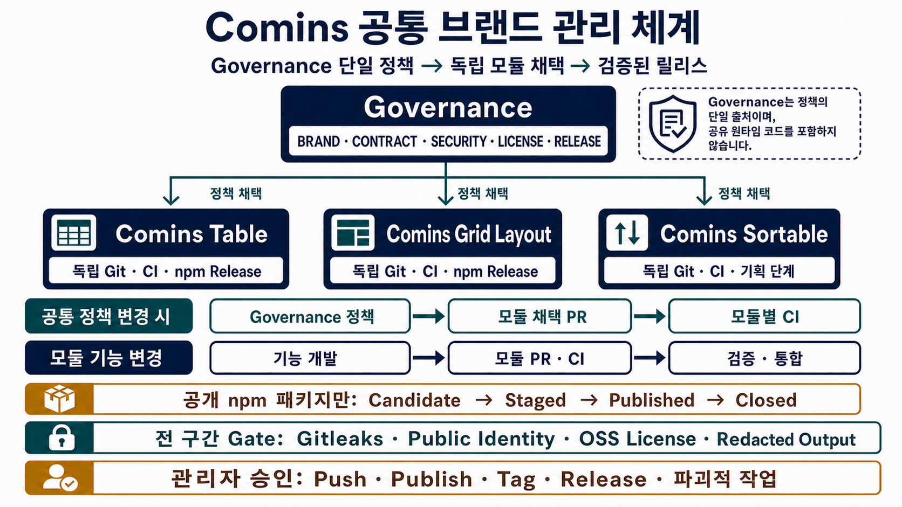

# Comins 개발 및 프로젝트 관리 가이드

> 정책 기준일: 2026-07-29 (Asia/Seoul)
> 운영 상태 스냅샷: 2026-07-28
> 적용 범위: `comins-governance`, `comins-table`, `comins-layout`,
> `comins-sortable` 및 향후 독립 Comins 모듈
> 문서 성격: 현재 저장소 정책과 운영 설정을 한곳에서 찾아보기 위한 관리자용
> 안내서

이 문서는 Comins 공통 브랜드를 누가, 어디에서, 어떤 순서와 승인 경계로
관리하는지 설명한다. 정책의 원문을 대체하지 않으며, 충돌이 있으면
Governance의 활성 정책 문서와 각 모듈의 적용 가능한 `AGENTS.md`가 우선한다.



## 1. 30초 요약

1. `<comins-root>`는 여러 저장소를 모아 둔 상위 폴더이며 Git 저장소가 아니다.
2. `governance`가 브랜드, 공통 계약, 민감정보, OSS 라이선스, 보안,
   릴리스 정책과 모듈 템플릿을 소유한다.
3. `data-table`, `grid-layout`, `sortable`은 각각 독립 Git 저장소다. 소스,
   이슈, PR, CI, 버전, npm 배포 이력도 서로 독립적으로 관리한다.
4. Governance 변경은 모듈에 자동 적용되지 않는다. `comins-reference`로
   관리 블록을 동기화하고 각 모듈의 별도 변경과 PR로 채택한다.
5. 공통 지침은 짧고 프레임워크 중립적으로 유지한다. API, 디렉터리 소유권,
   성능, 브라우저, 실제 검증 명령은 각 모듈이 소유한다.
6. 개발은 변경 위험에 맞춰 조사, 설계, 테스트, 검증 깊이를 선택한다.
   모든 작업에 동일한 전체 절차를 강제하지 않는다.
7. 민감정보 방지는 로컬 Git hook, PR CI, 공개 Git identity 검사, Gitleaks,
   정확한 패키지 artifact 검사로 중첩 적용한다.
8. OSS 라이선스는 사용 표면·정확한 버전·출처·수정 여부·동봉 의무를
   증명해야 하며, 누락·모호·제한·미승인 항목은 PR과 릴리스를 차단한다.
9. `push`, `publish`, tag, GitHub Release, 외부 설정 변경, 파괴적 작업은
   관리자의 명시 요청이 있어야 한다.
10. npm 레지스트리에 버전이 보이는 시점은 완료가 아니다. 공개 artifact,
    dist-tag, integrity, signature, provenance, consumer smoke, 소스 병합,
    브랜치 정합성까지 확인한 `Closed` 상태만 릴리스 완료다.

## 2. 브랜드 원칙

### 2.1 제품 정체성

- Comins는 하나의 거대한 프레임워크가 아니라, 특정 UI·상호작용 문제를
  해결하는 독립 React npm 모듈 브랜드다.
- 각 모듈은 Comins runtime, 공통 design system, 다른 Comins 모듈 없이
  사용할 수 있어야 한다.
- 공개 API, 예측 가능한 통합, 접근 가능한 상호작용, 실제 소비자 관점의
  검증을 제품 기준으로 삼는다.
- Codex AI 보조 개발은 엔지니어링 방식일 뿐, runtime 의존성이나 관리자의
  릴리스 책임을 대체하지 않는다.

### 2.2 명명

- 공개 문서와 Playground의 제품명은 `Comins <Module Name>` 형식을 쓴다.
- npm 이름은 가능하면 `comins-<domain>` 형식을 사용한다.
- GitHub 저장소 이름은 공개 패키지 이름과 맞추되, 기존 저장소 이름 변경은
  별도 migration 승인 없이 수행하지 않는다.
- KMSF 표기는 migration 역사 자료에서만 사용하고 현재 제품 정체성에는
  사용하지 않는다.

### 2.3 시각 정체성

- runtime UI가 소비자 애플리케이션에 Comins 로고, favicon, font, 마케팅
  문구를 주입하면 안 된다.
- 공용 wordmark와 아이콘 체계는 아직 정식 정책으로 확정되지 않았다.
- 문서와 Playground는 모듈을 설명할 수 있지만, 소비자에게 Comins 시각
  시스템 채택을 요구하면 안 된다.
- 이 문서의 인포그래픽은 내부 운영 설명용이며 공용 로고나 wordmark가 아니다.

## 3. 저장소와 소유권

### 3.1 물리 구조

```text
<comins-root>/                 # Git 저장소가 아닌 상위 폴더
├── governance/               # 공통 정책의 단일 소스
├── data-table/               # comins-table 독립 저장소
├── grid-layout/              # comins-grid-layout 독립 저장소
└── sortable/                 # Comins Sortable 독립 저장소
```

상위 폴더의 파일은 네 저장소 어디에도 자동으로 추적되거나 배포되지 않는다.
따라서 공통 정책은 반드시 `governance`에 두고, 제품 구현은 해당 모듈
저장소에 둔다.

### 3.2 책임 분리

| 관리 대상 | 최종 소유자 | 관리 위치 | 변경 방식 |
|---|---|---|---|
| 브랜드·명명·소비자 중립성 | Governance | `BRAND.md` | Governance PR |
| 공통 운영 계약 | Governance | `COMINS_CONTRACT.md` | 버전·CHANGELOG·Governance PR |
| 민감정보·공개 identity | Governance | `SENSITIVE_DATA_STANDARD.md` | 정책·검사 계약 검증 |
| OSS 라이선스 판정·증거 | Governance | `OSS_LICENSE_POLICY.md` | Contract·정책·모듈별 채택 |
| 공통 릴리스 상태·증거 | Governance | `RELEASE_POLICY.md` | Governance PR |
| 신규 모듈 기준 | Governance | `MODULE_CHECKLIST.md` | Governance PR |
| 공통 Codex 지침·설정 | Governance | module template | `comins-reference` 후 모듈별 PR |
| 제품 API·타입·소스 | 각 모듈 | `src/`, package exports | 해당 모듈 PR |
| 성능·브라우저·접근성 계약 | 각 모듈 | 모듈 `AGENTS.md`, docs, tests | 해당 모듈 PR |
| CI·패키징·npm 배포 | 각 모듈 | `.github/`, scripts, `package.json` | 해당 모듈 PR·승인 |
| 작업 증거 | 각 저장소 | `reports/YYYY-MM-DD.md` | 의미 있는 변경에만 기록 |

### 3.3 현재 모듈 상태

| 저장소 | 제품 상태 | 공개 패키지 | 기본 검증 | 릴리스 자동화 |
|---|---|---|---|---|
| Governance | 공통 정책 저장소, runtime 없음 | 없음 | `node --test test/*.test.mjs` | 없음 |
| Data Table | 공개 React Data Table | `comins-table@0.1.4` | `npm run verify` | 수동 OIDC staging |
| Grid Layout | 공개 React/GridStack adapter | `comins-grid-layout@0.1.5` | `npm run verify` | 수동 OIDC staging |
| Sortable | API·runtime·package 경계 미정 | 없음 | `node --test test/*.node.mjs` | 의도적으로 없음 |

Sortable에는 패키지 경계가 승인되기 전까지 `package.json`, npm 명령,
artifact 검사, publish workflow를 만들지 않는다.

## 4. 정책과 지침의 우선순위

### 4.1 활성 정책 문서

| 문서 | 역할 |
|---|---|
| `BRAND.md` | 공개 제품 정체성, 명명, 시각 경계 |
| `COMINS_CONTRACT.md` | 모든 모듈이 채택하는 공통 계약 |
| `SENSITIVE_DATA_STANDARD.md` | 민감정보 금지, 허용값, 필수 gate, 사고 대응 |
| `OSS_LICENSE_POLICY.md` | 제3자 코드·의존성·자산의 fail-closed 판정과 증거 |
| `RELEASE_POLICY.md` | Candidate부터 Closed까지의 릴리스 계약 |
| `MODULE_CHECKLIST.md` | 신규 모듈 생성·첫 PR·첫 공개 릴리스 기준 |
| `SECURITY.md` | 비공개 취약점 접수와 공개 전 보안 전제 |
| `CHANGELOG.md` | Governance 정책 변경 이력 |
| `AGENTS.md` | Governance 작업 시 자동 적용되는 짧은 실행 지침 |

`reports/`와 완료된 `docs/superpowers/plans`, `specs`는 당시 작업의 역사적
증거다. 현재 정책과 충돌하면 활성 루트 정책을 따른다.

### 4.2 Codex 지침 해석 순서

1. 사용자·조직의 상위 지침과 명시 요청을 확인한다.
2. 작업 중인 독립 저장소의 root `AGENTS.md`를 적용한다.
3. 대상 경로에 더 가까운 `AGENTS.md`가 있으면 그 경로의 추가 규칙을
   적용한다.
4. API·보안·릴리스·라이선스·공통 정책 작업일 때만 관련 Governance
   정책 원문을 읽는다.
5. 반복 가능한 특수 workflow는 해당 Skill이 활성화된 경우에만 읽는다.
6. 완료된 계획과 리포트는 참고 증거로만 사용한다.

Grid Layout은 `src/core`, `src/gridstack`, `src/components`, `test`,
`example`에 path-local `AGENTS.md`가 있다. Data Table과 Sortable은 현재
root `AGENTS.md`만 자동 지침으로 사용한다.

### 4.3 관리 블록과 모듈 지침

각 모듈 root `AGENTS.md`는 다음 두 영역으로 나뉜다.

```text
<!-- comins-reference:managed-start contract=v1.3 -->
Governance가 소유하는 공통 블록
<!-- comins-reference:managed-end -->

## Module Guidance
모듈이 소유하는 API, 경로, 성능, 검증 규칙
```

- `comins-reference`는 marker 안의 공통 블록과 `.codex/config.toml`의
  관리 블록만 갱신한다.
- marker 밖의 모듈 고유 내용은 byte 단위로 보존해야 한다.
- marker가 없거나 잘못된 기존 파일은 자동 덮어쓰지 않는다.
- symlink로 연결된 관리 표면도 자동 수정하지 않는다.
- 두 관리 표면을 먼저 검사한 뒤 함께 쓰며, 중간 실패 시 부분 적용을
  남기지 않는다.
- Contract 문자열만 같다고 최신 채택이 증명되는 것은 아니다. template
  내용과 변경 diff를 함께 검토한다.
- Governance의 canonical template은 Contract v1.3이다. 기존 모듈의 v1.2
  블록은 각 저장소에서 별도 검토·채택되기 전까지 자동으로 바뀌지 않는다.

### 4.4 프로젝트 Codex 설정

현재 네 저장소의 관리 설정은 동일하다.

```toml
model = "gpt-5.6-sol"
model_reasoning_effort = "xhigh"
plan_mode_reasoning_effort = "xhigh"
```

이 설정은 Codex가 해당 저장소를 신뢰한 경우에만 적용된다. 파일이 존재한다는
사실만으로 현재 세션의 실제 모델 설정이 증명되지는 않는다.

### 4.5 공통 Skill

| Skill | 사용하는 때 | 수정 범위 |
|---|---|---|
| `comins-reference` | 신규 모듈 지침 초기화, Governance 변경 채택 | 승인된 모듈의 관리 블록 |
| `comins-updatemd` | 지침 drift, model·공식 지침 변경, token·latency 감사 | Governance 지침 시스템 |

`comins-updatemd`는 모듈을 직접 수정하지 않는다. Governance 변경이 승인된
뒤 각 모듈 root에서 별도 `comins-reference` 작업을 수행한다.

## 5. 변경 유형별 작업 경로

### 5.1 고정 관리 순서

모든 Comins 작업은 다음 단계를 순서대로 평가한다.

1. 독립 Git root와 사용자·root·path-local 지침을 확인한다.
2. 공통 Contract, 범위, 권한, 승인 경계와 변경 유형을 확인한다.
3. 민감정보·보안 요구사항을 판정한다.
4. OSS 라이선스 사용 표면과 증거를 판정한다.
5. 모듈 고유 API·경로·브라우저·성능·명령 규칙을 적용한다.
6. 승인된 최소 구현 또는 문서 변경을 수행한다.
7. 변경 표면에 필요한 focused·baseline·browser·artifact·consumer 검증을
   수행한다.
8. Git hook·diff hygiene·PR CI·protected branch check를 통과한다.
9. 공개 패키지 릴리스라면 exact artifact 하나를 검증하고 staging한다.
10. 공개 후 closure와 의미 있는 변경 리포트를 완료한다.

각 단계는 생략하지 않고 평가한다. 변경 표면이 gate를 유발하지 않을 때만
`N/A`로 기록할 수 있다. 필요한 gate가 없거나 실행할 수 없거나, 증거가
불완전하거나 실패하면 다음 단계로 진행하지 않는다.

### 5.2 변경 위험에 따른 깊이

| 변경 유형 | 기본 경로 | 기본 검증 |
|---|---|---|
| 조사·상태 확인 | 관련 증거를 읽고 보고, 파일 수정 없음 | 읽기 전용 확인 |
| 문서·지침·결정적 설정 | 범위 내 직접 수정 | reference, parse, instruction, diff |
| 명확한 기능·버그 | 수용 조건 또는 재현 → 가치 있는 회귀 테스트 → 구현 | focused check → baseline 1회 |
| 공개 API·성능·migration | 미확정 결정 조사 → 필요한 설계·계획 → 점진 검증 | focused → broad gate 1회 |
| 보안·릴리스·외부·파괴적 작업 | canonical policy와 rollback 확인 → 명시 승인 | 단계별 정확한 증거 |

Research, design, plan, TDD, review, 전체 gate를 모든 작업에 기계적으로
연결하지 않는다. 위험과 변경 표면이 실제로 요구할 때만 사용한다.

## 6. 공통 정책 변경과 모듈 채택

### 6.1 Governance 변경

1. 영향을 받는 모듈이 둘 이상인지, 또는 보안·라이선스·릴리스·소비자
   개인정보와 같은 공통 경계인지 확인한다.
2. 모듈 하나의 API·성능·브라우저 명령이면 Governance가 아니라 해당
   모듈에 둔다.
3. 현재 Git root, branch, dirty 상태, 활성 worktree를 확인한다.
4. 관련 정책 원문과 `CHANGELOG.md`를 수정한다.
5. 공통 `AGENTS` 또는 `.codex` 내용이면 template만 canonical source로
   수정한다.
6. 변경 표면에 맞는 Governance focused test를 실행한다.
7. 계약이 여러 정책·script·test 표면을 가로지르면 전체 Governance
   `node --test test/*.test.mjs`를 한 번 실행한다.
8. `git diff --check`와 reference 검사를 통과시킨다.
9. Governance PR로 먼저 검토·병합한다.
10. 영향 모듈과 채택해야 할 revision을 명시한다.

공통 규칙은 “두 모듈 이상에 공통” 또는 “보안·라이선스·릴리스·개인정보
불변조건”일 때만 항상 로드되는 지침으로 승격한다.

### 6.2 기존 모듈 채택

Governance가 검토된 뒤 각 독립 모듈에서 별도로 수행한다.

```sh
node <governance-root>/.agents/skills/comins-reference/scripts/sync-guidance.mjs \
  update --target <module-root>
```

채택 순서:

1. 대상이 정확한 독립 Git root인지 확인한다.
2. Contract version과 관련 `CHANGELOG.md`를 확인한다.
3. target의 `AGENTS.md`와 `.codex/config.toml` marker를 사전 검사한다.
4. update를 실행한다.
5. 공통 블록 diff와 모듈 고유 영역 diff를 각각 검토한다.
6. 모듈 고유 내용이 보존됐는지 확인한다.
7. `git diff --check`, config parse, instruction/security test를 실행한다.
8. 제품 동작이 바뀌지 않았다면 제품 전체 gate는 실행하지 않는다.
9. 채택 Contract version, Governance revision, 변경 파일, 검증, 잔여 위험을
   기록한다.
10. 각 모듈의 별도 PR로 병합한다.

### 6.3 신규 모듈 초기화

신규 모듈은 먼저 목적과 경계를 승인한 뒤 독립 저장소로 만든다.

1. 기존 Comins 모듈과 중복되지 않는 하나의 frontend 문제를 정의한다.
2. public npm 이름, GitHub 이름, owner, MIT 저작권 주체를 확정한다.
3. framework, runtime, browser, peer dependency, SSR, package manager,
   public API, primary workflow를 정한다.
4. 독립 Git 저장소를 만든다.
5. 다음 명령으로 공통 지침과 설정을 초기화한다.

```sh
node <governance-root>/.agents/skills/comins-reference/scripts/sync-guidance.mjs \
  init --target <new-module-root>
```

6. 확인된 사실만으로 `## Module Guidance`를 추가한다.
7. README, lockfile, focused unit/build, 필요한 browser path를 추가한다.
8. 첫 commit 전에 local Gitleaks hook을 설치한다.
9. 첫 PR 전에 민감정보 CI와 repository license gate를 추가한다.
10. 첫 공개 릴리스 전 MIT license, `THIRD_PARTY_NOTICES.md`, 필요한
    `THIRD_PARTY_LICENSES/`, PVR, `SECURITY.md`, dependency·secret
    scanning, 정확한 artifact gate를 완료한다.

## 7. 기능·버그 개발 순서

### 7.1 작업 시작 전

```sh
git rev-parse --show-toplevel
git branch --show-current
git status --short --branch
git worktree list
git remote -v
```

확인할 사항:

- 현재 위치가 `<comins-root>`가 아니라 실제 독립 저장소 root인지 확인한다.
- 사용자 또는 다른 작업의 staged, unstaged, untracked 변경을 보존한다.
- 연결 worktree가 사용하는 branch를 임의로 이동·삭제하지 않는다.
- 공개 API, 타입, package export, CSS, browser 동작 영향 여부를 먼저 정한다.
- 위험도에 맞는 완료 조건과 회귀 확인 방법을 정한다.

### 7.2 브랜치와 worktree

- 통합 대상은 각 저장소의 `main`이다.
- 최근 이력에는 `agent/<topic>`과 `codex/<topic>` 이름이 사용되고 있으나,
  이는 관찰된 관례이며 canonical naming policy는 아니다.
- 동시에 진행되는 큰 작업은 별도 worktree로 격리할 수 있다.
- primary worktree가 dirty하면 기존 변경을 덮어쓰지 않는다.
- 병합 작업은 필요한 경우 임시 worktree에서 수행하고, 병합된 SHA에서
  검증한다.
- branch와 worktree 삭제는 병합 여부, 활성 사용 여부, rollback 필요성을
  확인하고 별도 승인 후 수행한다.

### 7.3 구현

1. 대상 root와 더 가까운 `AGENTS.md`를 적용한다.
2. 공개 계약을 깨지 않는 최소 변경을 선택한다.
3. 재현 가능한 defect, deterministic logic, 공개 계약, 위험한 refactor는
   가치가 있을 때 가장 작은 회귀 테스트를 먼저 둔다.
4. focused test를 통과시키며 구현한다.
5. 관련 없는 refactor, 일괄 format, 신규 dependency를 섞지 않는다.
6. dependency 또는 설정 변경이면 lockfile, build, side effect를 함께
   확인한다.
7. 의미 있는 코드·test-contract 변경 후 모듈 baseline을 한 번 실행한다.
8. browser-visible 동작은 실제 browser gate를 실행한다.
9. 실패는 제품, test contract, 실행 환경으로 분류한 뒤 수정 또는 재시도한다.

### 7.4 변경 완료 전

- `git diff`로 요청 범위 밖 변경이 없는지 확인한다.
- `git diff --check`를 실행한다.
- 필요한 focused·baseline·browser·artifact 검증 결과를 확인한다.
- 실패하거나 실행하지 못한 필수 gate를 명시한다.
- 의미 있는 변경이면 모듈 관례에 따라 report를 갱신한다.
- commit, push, PR, publish 권한이 각각 있는지 다시 확인한다.

## 8. Git hook과 민감정보 방지

### 8.1 설치

Data Table과 Grid Layout:

```sh
npm run setup:hooks
```

Governance와 Sortable 또는 수동 확인:

```sh
git config core.hooksPath .githooks
git config --get core.hooksPath
```

현재 네 저장소 모두 로컬 `core.hooksPath=.githooks`가 설정돼 있다. 새 clone은
로컬 Git config를 상속하지 않으므로 다시 설치해야 한다.

### 8.2 pre-commit

공통 동작:

1. 공개 Git identity 규칙을 검사한다.
2. 설치된 Gitleaks가 고정 버전 `8.30.1`인지 확인한다.
3. staged 변경을 Gitleaks로 검사한다.
4. raw stdout·stderr를 임시 파일에만 담고 삭제한다.
5. 실패 시 값·author·email·path를 노출하지 않는 상수 메시지만 출력한다.
6. scanner가 없거나 버전이 다르면 fail closed 한다.

Data Table은 추가로 staged repository hygiene를 검사한다.

### 8.3 pre-push

Data Table, Grid Layout, Sortable은 push 대상 commit range마다 다음을 검사한다.

- 공개 Git identity
- Gitleaks commit-range scan
- redacted constant output

Governance는 현재 tracked pre-push hook이 없고 pre-commit과 PR/main CI를
사용한다.

### 8.4 CI

PR과 `main` push에서:

- full history를 credential 없이 checkout한다.
- reviewed base/head SHA 범위를 계산한다.
- 공개 Git identity를 검사한다.
- checksum으로 고정한 Gitleaks `8.30.1`을 설치한다.
- reviewed range를 redacted mode로 검사한다.
- Governance와 Sortable은 같은 `Sensitive data` job에서 정책·보안 계약
  테스트와 `git diff --check`를 실행한다.
- Data Table과 Grid Layout은 별도 product `verify` job을 실행한다. 두
  workflow에는 현재 `git diff --check`가 없으므로 diff hygiene는 로컬
  완료 gate에서 별도로 확인한다.

### 8.5 금지·허용 데이터

금지:

- 개인 이름, 개인 email, 로컬 계정 경로
- credential, API key, token, secret
- 실제 값에서 파생한 fingerprint
- detector의 실제 author, email, match, fingerprint, 민감 path 출력
- `.gitleaksignore`, inline `gitleaks:allow`

허용:

- 승인된 공개 handle
- GitHub noreply identity
- service identity
- 명시적 placeholder
- repository-relative path
- 법적으로 필요한 canonical-source 제3자 copyright·attribution·license·`NOTICE`
  원문. canonical project URL로 대체할 수 있는 개인 연락처는 기록하지 않는다.
- 테스트 실행 시에만 조립되고 저장되지 않는 synthetic fixture

현재 변경 gate가 과거 history, cached object, npm registry metadata, 공개
profile까지 깨끗함을 증명하지는 않는다. legacy·provider 노출은 별도 감사로
수행한다.

## 9. OSS 라이선스 Fail-closed 관리

### 9.1 원문과 판정 범위

상세 판정의 단일 원문은 `OSS_LICENSE_POLICY.md`다. 자동 검사는 법률 적합성을
선언하지 않고, Comins 정책에 필요한 증거가 재현 가능한지만 판정한다.

모든 제3자 항목을 다음 사용 표면 중 하나 이상으로 분류한다.

| 사용 표면 | 예시 | 기본 증거 |
|---|---|---|
| 개발 전용 도구 | test runner, bundler, lint 도구 | lockfile·SPDX·배포 제외 확인 |
| peer·외부 runtime | React, 외부 engine | 정확한 version range·SPDX·source |
| 번들 runtime·transitive | package bundle에 포함된 코드 | 정확한 version·bundle 경계·notice |
| 복사·수정 코드 | snippet, vendored source, 생성 코드 | source·revision·수정 여부·의무 |
| 자산 | font, icon, image, data, WASM | source·license text·배포 위치 |
| 생성 결과물 | demo, 문서, binary, tarball | 포함된 제3자 material과 원본 연결 |

version, source, 수정 여부, 사용 표면이 바뀌면 기존 판정을 재사용하지 않고
다시 검토한다.

### 9.2 자동 통과와 관리자 검토

정확한 metadata·upstream 원문·실제 사용 표면이 일치할 때만 다음 SPDX
identifier가 자동 통과한다.

| 자동 통과 | 추가 조건 |
|---|---|
| `MIT`, `MIT-0`, `ISC`, `0BSD` | copyright·license text 의무 유지 |
| `BSD-2-Clause`, `BSD-3-Clause` | 해당 고지와 조건 유지 |
| `Apache-2.0` | 필요한 license·upstream `NOTICE`·수정 표시 유지 |
| `OFL-1.1` | 수정하지 않은 font, 전문 동봉, Reserved Font Name 조건 기록 |

다음은 관리자가 정확한 component·version·사용 표면을 승인하기 전까지
fail closed 한다.

- license 누락, `NOASSERTION`, `UNLICENSED`
- custom 조건, `LicenseRef`, 파일 참조만 있는 license
- `AND`, `OR`, `WITH`를 사용하는 복합 SPDX 표현식
- copyleft·weak copyleft·source-available·proprietary
- noncommercial·no-derivatives·field-of-use·상업·재배포 제한
- metadata, upstream 원문, source, bundle, 사용 표면의 불일치
- 출처·revision·수정 여부·의무를 재현할 수 없는 코드·자산·생성물

승인 기록에는 component, 정확한 version 또는 revision, 사용 표면, 조건,
근거, 승인된 공개 handle 또는 역할, 검토일, 재검토 조건을 기록한다.
저장소 전체 예외, license family 전체 allowlist, version range, inline bypass,
구두 승인만으로는 통과시키지 않는다.

### 9.3 증거 파일

배포되거나 runtime 경계에 관여하는 제3자 항목은
`THIRD_PARTY_NOTICES.md`에 다음을 기록한다.

- component와 정확한 version·revision
- 사용 표면과 실제 배포 여부
- SPDX 또는 관리자 검토 분류
- canonical source
- 복사·수정 여부
- copyright, attribution, license text, `NOTICE`, 수정 표시, 재배포 의무
- 해당되는 scoped approval 참조

배포 artifact에 전문이 필요한 경우
`THIRD_PARTY_LICENSES/<component>-<version>.txt` 형태로 보관하고
`package.json#files` 및 exact artifact에 포함한다. 개발 전용 도구는 그
자체나 결과물이 배포되지 않으면 공개 notice에 복제하지 않지만 repository
license gate는 통과해야 한다.

### 9.4 PR·CI gate

다음 변경은 repository license gate 실행 대상이다.

- dependency, lockfile, peer range
- bundle·external 경계
- 복사·수정·생성 코드
- font·icon·image·data·WASM 자산
- notice, license 전문, package file allow-list

package 경계가 있으면 결정적 `check:licenses` 명령을 baseline `verify`에
포함하고 실제 bundle·artifact를 검사한다. Contract v1.3을 별도 채택한 뒤
package 경계가 없는 저장소는 tracked material에 정책을 적용하되 가상의 npm
명령을 만들지 않는다. gate·metadata·source·notice·전문·승인이 없거나
검사할 수 없으면 PR을 차단한다.

### 9.5 릴리스와 legacy

Candidate 단계에서 reviewed dependency·자산 상태와 consumer smoke에 사용할
exact artifact 하나를 같은 license gate로 검사한다. artifact에는 Comins
`LICENSE`, 적용되는 `THIRD_PARTY_NOTICES.md`, 필요한
`THIRD_PARTY_LICENSES/`와 upstream `NOTICE`가 있어야 하며, 기록되지 않은
번들·복사 material이 없어야 한다.

하나라도 누락되거나 검증 artifact와 staging artifact가 다르면 staging과
publish를 중단한다. 긴급 release도 이 gate를 우회하지 않는다.

기존 공개 버전은 current-change gate와 별도로 exact version 단위로 감사한다.
새 버전에서 dependency를 제거하거나 notice를 추가해도 과거 npm artifact가
바뀌지는 않는다. deprecate, unpublish, provider support, 법적 조치는 별도
관리자 결정이다.

2026-07-29에 교차 확인한 Data Table 선행 사례에서는 현재·향후 source와
artifact에서 Lucide를 제거하고, npm `0.1.0`~`0.1.4`의 포함 사실과
Lucide·Feather 고지를 모듈 `THIRD_PARTY_NOTICES.md`에 유지했다. package
artifact gate는 dependency section, bundle, source map의 재유입을
차단한다. 이는 Contract v1.2에서 수행된 모듈별 보정 사례이며 Contract
v1.3 채택으로 보지 않는다.

이 Governance 변경은 공통 원문과 template만 갱신한다. Data Table, Grid
Layout, Sortable의 Contract v1.3 채택과 실제 module gate 변경은 각 독립
저장소의 별도 PR에서 수행한다.

## 10. 저장소별 검증

### 10.1 Governance

| 변경 | 검증 |
|---|---|
| Markdown·config | reference/parse/instruction check, `git diff --check` |
| Skill·script | focused Node test, 공식 skill validation |
| 공통 계약 교차 변경 | `node --test test/*.test.mjs` |
| Governance-only 변경 | 모듈 제품 gate 실행 금지 |

Governance에는 의도적으로 `package.json`과 제품 build가 없다.

### 10.2 Data Table

```sh
npm run verify
npm run verify:e2e
npm run verify:full
npm run test:perf -- --workers=1
npm run verify:package-artifact
npm run test:consumer -- <exact-tarball>
```

| 명령 | 포함 범위 |
|---|---|
| `verify` | hygiene → security contract → TypeScript → Vitest → build |
| `verify:e2e` | `@perf`를 제외한 Playwright |
| `verify:full` | `verify` + 비성능 Playwright |
| `test:perf` | virtualization·scroll·memory 성능 spec |
| `verify:package-artifact` | 정확한 tarball allow-list와 package 경계 |
| `test:consumer` | 정확한 tarball 소비자 설치 smoke |

주의:

- `verify:full`에는 `@perf` 성능 gate가 포함되지 않는다.
- `verify` 자체가 실제 Git range Gitleaks scan을 대체하지 않는다.
- 공개 문서 동작 변경은 `test/user-docs.test.ts`를 실행한다.
- Playground·UI 변경은 affected Playwright spec을 먼저 실행한다.
- virtualization, scrolling, memory counter는 focused performance 후 의미 있는
  변경에서 전체 `test:perf`를 한 번 실행한다.
- 영문 public docs 변경은 대응하는 `docs/ko/` 문서도 맞춘다.

### 10.3 Grid Layout

```sh
npm run verify
npm run verify:e2e
npm run verify:full
npm run verify:package-artifact
npm run test:consumer -- <exact-tarball>
```

| 명령 | 포함 범위 |
|---|---|
| `verify` | security contract → third-party notice → TypeScript → Vitest → build |
| `verify:e2e` | Playwright browser interaction |
| `verify:full` | `verify` + Playwright |
| `verify:package-artifact` | file allow-list, license·notice, external bundle 경계 |
| `test:consumer` | 정확한 tarball의 React consumer smoke |

GridStack lifecycle, drag, resize, column cycle, browser-visible 변경은 focused
검증 후 `verify:full`을 실행한다. 100개 이상 widget과 반복 column 변경은
기본 성능 계약이며 `docs/04-verification-strategy.md`의 resource gate를
따른다.

### 10.4 Sortable

```sh
node --test test/*.node.mjs
git diff --check
```

아직 public API와 package 경계가 없으므로 npm, build, publish gate를
발명하지 않는다. 현재 테스트는 이 미정 상태와 보안 baseline 자체를
계약으로 고정한다.

## 11. PR·CI·main 통합

### 11.1 PR 기본 흐름

1. 변경 branch에서 focused와 required local gate를 통과시킨다.
2. 요청 범위, public impact, 실행 검증, 미실행 검증, 잔여 위험을 PR에
   기록한다.
3. PR CI가 reviewed commit range와 제품 gate를 검증한다.
4. required check와 strict update 조건을 만족한다.
5. protected `main`으로 merge한다.
6. merge SHA에서 필요한 post-merge 또는 release 검증을 수행한다.
7. branch/worktree 정리는 별도 승인과 ancestry 확인 후 수행한다.

### 11.2 현재 GitHub `main-protection` ruleset

네 저장소 모두 2026-07-28 기준 다음 공통 ruleset을 사용한다.

- 기본 branch 대상 active ruleset
- PR을 통한 변경 요구
- branch 삭제 금지
- non-fast-forward와 force push 금지
- bypass actor 없음
- required check는 최신 base와 strict하게 맞아야 함
- merge, squash, rebase 방식 허용
- GitHub가 강제하는 승인 review 수는 `0`
- review thread 해결은 강제되지 않음

저장소별 required check:

| 저장소 | GitHub가 강제하는 check |
|---|---|
| Governance | `Sensitive data` |
| Data Table | `verify`, `CodeQL` |
| Grid Layout | `Sensitive data`, `verify` |
| Sortable | `Sensitive data` |

Governance와 Sortable의 `Sensitive data` job 안에는 정책 테스트와 diff
검사가 함께 들어 있다. Data Table은 별도 `Sensitive data` job이 workflow에
있지만 현재 ruleset required context에는 포함되지 않는다.

### 11.3 현재 저장소 설정

공통 확인값:

- public repository
- default branch `main`
- auto merge 비활성
- merge 후 branch 자동 삭제 비활성
- merge commit, squash, rebase 허용
- Dependabot security updates 활성
- secret scanning 활성
- secret scanning push protection 활성
- Private Vulnerability Reporting 활성

Data Table은 npm과 GitHub Actions dependency를 매주 월요일 09:00
Asia/Seoul에 확인하는 Dependabot 설정도 추적한다.

## 12. npm 릴리스

### 12.1 상태 모델

| 상태 | 의미 |
|---|---|
| Candidate | version, notes, exact artifact, 사전 증거 준비 |
| Staged | trusted publisher가 exact artifact를 staging, 2FA 승인 대기 |
| Published | public registry에서 version 확인, closure 미완료 |
| Closed | 모든 공개 후 검증과 증거·branch 정합성 완료 |

`Published`를 완료로 보고하지 않는다. `Closed`만 완료다.

### 12.2 최초 패키지

새 npm package는 registry에 존재하기 전 trusted publisher와 staged
publishing을 등록할 수 없다.

1. exact artifact와 모든 사전 gate를 준비한다.
2. 관리자가 automation token 없이 interactive 2FA로 최초 버전을
   bootstrap한다.
3. 즉시 정확한 GitHub repository, `publish.yml`, `npm` environment를
   trusted publisher로 등록한다.
4. 이후에는 `npm stage publish`만 허용하고 token publish를 사용하지 않는다.

### 12.3 이후 릴리스의 사전 gate

Data Table과 Grid Layout의 수동 `publish.yml`은 `main`에서만 실행한다.

1. workflow input version과 `package.json` version 일치
2. 기존 bootstrap package 존재 확인
3. immutable install
4. `verify:full`
5. `npm pack --json --ignore-scripts`로 artifact 하나만 생성
6. `package.json#files`와 실제 package file list 비교
7. 같은 artifact를 추출하고 Gitleaks scan
8. 같은 artifact로 consumer smoke
9. 검증한 artifact를 1일 보관 GitHub artifact로 전달
10. OIDC 권한의 `npm` environment에서 `npm stage publish`
11. 관리자와 npm 2FA 승인 후 공개

두 패키지의 GitHub `npm` environment는 현재:

- `main` branch만 deployment 허용
- required reviewer 1명
- self-review 방지 옵션은 비활성
- OIDC `id-token: write`
- 장기 npm automation token을 사용하지 않음

### 12.4 공개 후 Closure

1. 정확한 public version과 의도한 dist-tag를 확인한다.
2. public artifact의 integrity, registry signature, provenance를 확인한다.
3. workflow가 digest 또는 integrity를 제공하면 검증 artifact와 비교한다.
4. 정확한 public version 또는 tarball을 격리 consumer에 설치한다.
5. public consumer smoke를 실행한다.
6. protected source merge와 post-merge check를 확인한다.
7. release workflow run과 source commit을 기록한다.
8. closure 시각, version, dist-tag, 실행 check, 결과, 잔여 위험을 기존
   release evidence 뒤에 추가한다.
9. remote ref를 확인하고 local default branch를 remote default branch와
   맞춘다.
10. 남아 있는 release branch와 worktree를 보고한다.
11. 삭제는 별도 승인 후 수행한다.

하나라도 실패하거나 확인되지 않으면 상태는 `Published, not Closed`다.

## 13. 보안 취약점과 사고 대응

### 13.1 접수

- 모든 공개 저장소는 GitHub Private Vulnerability Reporting을 사용한다.
- 미패치 취약점을 public issue, PR, discussion, release note에 공개하지 않는다.
- private report를 remediation 중 source of truth로 사용한다.
- CVE는 영향과 사용자 범위가 public identifier를 정당화할 때만 요청한다.

### 13.2 사고

credential 노출, 개인정보 노출, 악성 dependency 신호, package compromise가
의심되면:

1. 영향받는 release·publication workflow를 중지한다.
2. reproduction, package version, commit SHA, 관련 log를 보존한다.
3. 노출 credential을 교체한다.
4. 값이 제거된 redacted evidence만 남긴다.
5. 영향과 affected version을 먼저 분류한다.
6. fix, release, disclosure 결정을 관리자 검토로 확정한다.
7. current-change gate와 legacy/provider remediation을 분리한다.

긴급 patch도 package ownership, provenance, disclosure review를 우회하지
않는다.

## 14. 리포트와 역사 자료

### 14.1 작성하는 경우

다음 중 의미 있는 변경이 있고 저장소가 report 관례를 제공할 때
`reports/YYYY-MM-DD.md`를 작성 또는 갱신한다.

- 제품 동작
- public API·타입
- runtime·project 설정
- 보안
- 릴리스
- test contract

조사만 수행했거나 단순 편집 문서만 바꾼 작업에는 report를 강제하지 않는다.

### 14.2 최소 내용

- 작업 일시
- 목적과 범위
- 변경 파일
- 실행한 검증과 결과
- 실패 분류
- 실행하지 못한 필수 검증
- 잔여 문제와 다음 조치
- 릴리스라면 exact version, artifact, workflow, public closure 증거

과거 report의 provider 상태나 package 상태를 현재 사실로 재사용하지 않는다.
현재 상태가 필요하면 다시 확인한다.

## 15. 관리자 승인 경계

### 15.1 범위 안에서 추가 승인 없이 가능한 일

- 관련 파일과 history 읽기
- 로컬 안전 변경
- focused test, lint, typecheck, unit, build, browser 검증
- diff와 Git 상태 확인
- 임시·격리 검증 artifact 생성

### 15.2 명시 승인이 필요한 일

- remote push
- PR merge 또는 provider-side write
- npm publish·staging 승인
- tag·GitHub Release
- branch·worktree 삭제
- history rewrite·force operation
- GitHub ruleset, environment, secret, PVR, publisher 설정 변경
- 비용 발생 작업
- public API·보안·릴리스 정책의 실질적 범위 확대

승인은 하나의 작업을 허용할 뿐 다른 외부 작업까지 포괄하지 않는다.

## 16. 현재 상태 스냅샷

다음은 2026-07-28에 로컬 파일, 실제 원격 `main`, GitHub read-only API,
npm registry를 확인한 Contract v1.2 시점의 운영 스냅샷이다. 작업 중 변경될
수 있으므로 운영 직전에 다시 확인한다.

| 저장소 | 현재 checkout | 실제 remote `main` | open PR | 작업 시작 시 로컬 주의사항 |
|---|---|---|---|---|
| Governance | `main` | 일치 | Draft #5 | 미추적 2026-07-27 report, prunable worktree metadata |
| Data Table | `main` | 일치 | Draft #19·#23, Dependabot #21·#22 | 미추적 report, linked worktree 2개 |
| Grid Layout | `codex/release-closure-policy` | checkout과 3/3 divergence | 없음 | 미추적 report, linked worktree 1개, branch upstream 없음 |
| Sortable | `main` | 일치 | 없음 | 미추적 report |

공개 npm:

- `comins-table`: `latest=0.1.4`
- `comins-grid-layout`: `latest=0.1.5`
- Sortable: 공개 package 없음

스냅샷 시점에는 세 모듈의 `AGENTS.md` 관리 블록과
`.codex/config.toml` 관리 블록이 당시 Contract v1.2 Governance template과
byte-for-byte 일치했고, 지침 inventory의 휴리스틱 finding도 네 저장소 모두
`0`이었다. Contract v1.3 Governance 변경 후에는 세 모듈이 v1.2 관리 블록을
유지하며 별도 채택을 기다린다. 이번 정책 갱신은 독립 모듈 저장소를 수정하지
않는다.

Draft PR #5와 #19의 Issue intake 자동화는 아직 `main`의 활성 운영 정책이
아니다. 현재 `main`에는 tracked Issue/PR template과 `CODEOWNERS`가 없다.

## 17. 확인된 잔여 위험과 개선 우선순위

### 높은 우선순위

1. **Data Table security check 강제 누락**

   workflow에는 `Sensitive data` job이 있지만 ruleset required check는
   `verify`, `CodeQL`만 강제한다. 보안 job 실패 상태에서 merge 가능 여부를
   닫으려면 `Sensitive data` context를 ruleset에 추가해야 한다.

2. **GitHub 승인 수 0**

   네 ruleset 모두 PR은 요구하지만 human approving review를 provider가
   강제하지 않는다. 현재 관리자 운영 방식과 맞는지 결정하고, 필요하면
   최소 1 approval과 thread resolution을 별도 승인 후 설정한다.

3. **npm environment self-review 허용**

   required reviewer는 있으나 self-review 방지가 꺼져 있다. single-maintainer
   운영 편의와 독립 승인 경계를 비교해 설정 여부를 결정한다.

### 중간 우선순위

4. **Governance revision 추적성**

   marker에는 Contract `v1.3`만 있고 Governance commit SHA는 없다. 같은
   Contract 아래 `Unreleased` 변경이 누적될 수 있으므로 채택 report와 PR에
   source Governance SHA를 기록한다.

5. **동기화 read-only check 부재**

   `sync-guidance.mjs`는 `init`, `update`만 제공하고 `check`·`dry-run`은 없다.
   현재 drift 확인은 수동 block 비교가 필요하다.

6. **Instruction inventory 한계**

   `findings: 0`은 네 가지 정규식 휴리스틱 결과다. Brand, Contract,
   Sensitive Data, Release, Checklist, Changelog 전체의 의미적 완전성을
   증명하지 않는다.

7. **Grid Layout service identity gate 미구현**

   npm service identity validator는 설계·계획 문서에만 있고 script,
   package command, workflow gate는 없다. 현재 릴리스 gate로 보고하면 안
   된다.

### 운영 정리 후보

8. Governance의 prunable worktree metadata, 각 저장소의 미추적 report,
   Grid Layout의 diverged local branch는 사용자 작업 여부와 merge ancestry를
   확인한 뒤 별도 정리한다.
9. tracked PR template, Issue template, `CODEOWNERS`가 없어 증거 형식과
   reviewer routing이 문서·운영자 기억에 의존한다. Draft Issue intake
   제안의 승인 여부와 함께 검토한다.
10. 현재 npm trusted publisher의 provider-side 등록값과 과거 registry
    metadata 정합성은 이 문서 감사 범위에서 재검증하지 않았다.
11. 이번 감사는 local-first 운영 감사이며 최신 외부 OpenAI·GitHub·npm
    공식 지침의 변경 여부를 갱신하지 않았다.

## 18. 빠른 운영 체크리스트

### 공통 정책 변경

- [ ] Governance 대상인지 admission rule 확인
- [ ] 정책 원문과 `CHANGELOG.md` 갱신
- [ ] template만 canonical source로 수정
- [ ] focused 또는 전체 Governance test
- [ ] `git diff --check`
- [ ] Governance PR 검토·병합
- [ ] 영향 모듈 목록과 Governance SHA 기록
- [ ] 모듈별 `comins-reference update`
- [ ] 모듈 고유 지침 보존 확인
- [ ] 모듈별 PR·CI·병합

### 기능·버그

- [ ] 정확한 Git root·branch·dirty state 확인
- [ ] 적용 가능한 root/path-local `AGENTS.md` 확인
- [ ] 공개 API·성능·browser 영향 확인
- [ ] 수용 조건 또는 재현 정리
- [ ] 가치 있는 focused regression test
- [ ] 최소 구현
- [ ] focused test
- [ ] baseline 1회
- [ ] 필요한 browser·performance gate
- [ ] diff·필수 미실행 검증·잔여 위험 확인

### OSS 라이선스

- [ ] 정확한 component version·revision과 canonical source
- [ ] 개발·peer·bundle·복사·자산·생성물 사용 표면
- [ ] SPDX와 upstream 원문 일치
- [ ] 자동 통과 조건 또는 scoped approval
- [ ] `THIRD_PARTY_NOTICES.md`와 필요한 `THIRD_PARTY_LICENSES/`
- [ ] dependency·lockfile·bundle·자산 변경에서 license gate
- [ ] exact artifact에 license·notice·전문 포함
- [ ] legacy 공개 version은 별도 감사

### PR

- [ ] 요청 범위 밖 파일 없음
- [ ] staged/unstaged/untracked 사용자 작업 보존
- [ ] hook과 local gate 통과
- [ ] public impact와 migration 설명
- [ ] 실행·미실행 검증 기록
- [ ] required checks 최신 상태
- [ ] merge 후 source SHA 확인
- [ ] branch/worktree 삭제는 별도 승인

### 릴리스

- [ ] version·SemVer 근거·notes
- [ ] reviewed dependency·자산 상태의 license gate
- [ ] `package.json#files` 경계
- [ ] exact artifact 하나 생성
- [ ] artifact file list·Gitleaks·license evidence 검사
- [ ] 같은 artifact consumer smoke
- [ ] `main` 수동 workflow
- [ ] OIDC staging·관리자·npm 2FA 승인
- [ ] public version·dist-tag
- [ ] integrity·signature·provenance
- [ ] public consumer smoke
- [ ] source merge·workflow run
- [ ] local/remote default branch 정합성
- [ ] release evidence append
- [ ] `Closed` 여부 명시

## 19. 근거 위치

Governance:

- `README.md`
- `BRAND.md`
- `COMINS_CONTRACT.md`
- `SENSITIVE_DATA_STANDARD.md`
- `OSS_LICENSE_POLICY.md`
- `MODULE_CHECKLIST.md`
- `RELEASE_POLICY.md`
- `SECURITY.md`
- `CHANGELOG.md`
- `AGENTS.md`
- `templates/module/AGENTS.template.md`
- `templates/module/.codex/config.toml`
- `.agents/skills/comins-reference/`
- `.agents/skills/comins-updatemd/`
- `.github/workflows/verify.yml`

모듈:

- 각 root `AGENTS.md`, `.codex/config.toml`, `SECURITY.md`
- Data Table·Grid Layout `package.json`, `.github/workflows/verify.yml`,
  `.github/workflows/publish.yml`, `.githooks/`, `scripts/`
- Grid Layout path-local `AGENTS.md`, `docs/04-verification-strategy.md`
- Sortable `.github/workflows/verify.yml`, `test/*.node.mjs`

현재 외부 상태:

- [Comins Governance](https://github.com/kim1124/comins-governance)
- [Comins Table](https://github.com/kim1124/comins-table)
- [Comins Grid Layout](https://github.com/kim1124/comins-layout)
- [Comins Sortable](https://github.com/kim1124/comins-sortable)
- [comins-table on npm](https://www.npmjs.com/package/comins-table)
- [comins-grid-layout on npm](https://www.npmjs.com/package/comins-grid-layout)
