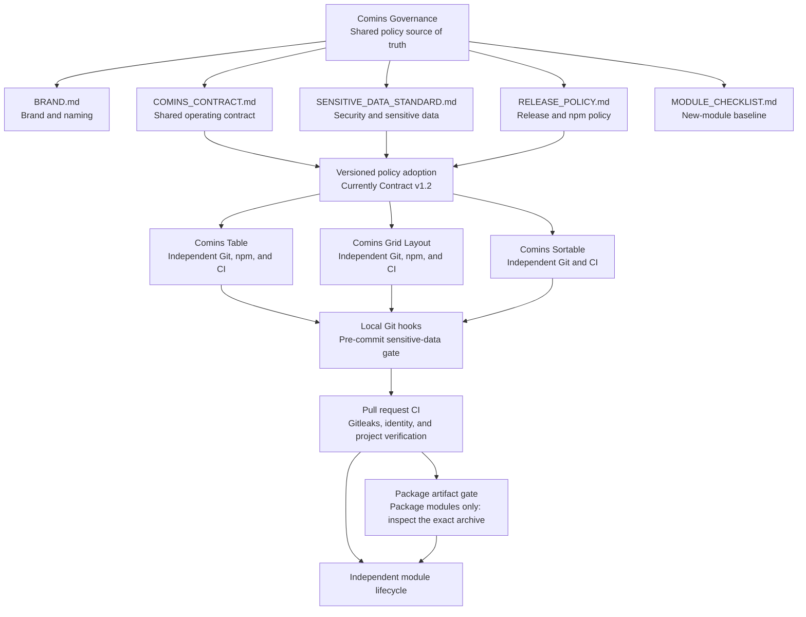

# Comins Governance

This repository is the source of truth for shared Comins brand guidance, operating contracts, and module templates.

Comins modules remain independent Git repositories and independent npm release units. This repository does not contain a runtime package, shared module source code, or a release pipeline for product packages.

## Contents

- `BRAND.md`: public product identity and naming rules.
- `COMINS_CONTRACT.md`: rules shared by every Comins module.
- `CHANGELOG.md`: shared-policy revision history.
- `MODULE_CHECKLIST.md`: readiness checklist for a new module.
- `SECURITY.md`: security reporting and response prerequisites.
- `RELEASE_POLICY.md`: package release and provenance requirements.
- `.codex/config.toml`: trusted-repository model and reasoning defaults.
- `templates/module/AGENTS.template.md`: non-discovered baseline guidance for a module repository.
- `templates/module/.codex/config.toml`: canonical module project configuration.
- `templates/module/.github/ISSUE_TEMPLATE`: concise public bug and feature request forms.
- `templates/module/.github/codex`: read-only Codex issue-analysis prompt and output schema.
- `templates/module/.github/workflows/codex-issue-analysis.yml`: maintainer-gated issue analysis and GitHub comment delivery.
- `.agents/skills/comins-request`: prints the copyable Comins work-request template.
- `.agents/skills/comins-reference`: initializes or refreshes a module's managed guidance and configuration.
- `.agents/skills/comins-updatemd`: audits and renews the effective Comins instruction system.

## Governance And Module Flow



The companion [development-flow visualization](docs/superpowers/specs/2026-07-22-comins-development-flow-renewal.png)
shows how task risk selects research, planning, test, and verification depth.

Shared policy changes are reviewed in this repository first and then adopted by
each affected module through its own pull request. The governance repository is
not a runtime dependency and does not synchronize module source or releases.

## Operating Model

1. Make module-specific product changes in the affected module repository.
2. Make cross-module policy changes here, then update each affected module in a separate reviewed change.
3. Keep package publication, versioning, CI, and npm credentials isolated per module.

## Development Workflow

| Change class | Default route |
|---|---|
| Inspection or research | Inspect relevant evidence and report; do not edit or run product gates |
| Documentation, guidance, or configuration | Make the scoped change and run reference, instruction, parse, and diff checks |
| Clear local behavior | Reproduce or define acceptance, add a valuable focused regression test, implement, then run the baseline once |
| Complex or high risk | Research material unknowns, close decisions, use a design or plan when needed, test incrementally, then run the applicable broad gate once |
| Security, release, external, or destructive | Follow canonical policy and obtain the operation-specific approval |

Research, design, planning, TDD, review, and broad verification are selected by
risk; they are not one mandatory sequence for every change.

## Comins Request Skill

Invoke `$comins-request` to print the concise request form for investigation,
feature, modification, deletion, maintenance, or remote-operation work. Fill the
form and send it as a separate request; invoking the skill does not start work.

## Public Issue Intake

Public reporters provide observable behavior, reproduction, environment, use
case, and expected outcome through the concise module Issue Forms. They do not
define implementation scope, completion gates, or work authority. Codex may
analyze the untrusted report with the strict read-only schema under
`templates/module/.github/codex`; a maintainer reviews that analysis before
creating an internal `$comins-request` brief or authorizing implementation.

Issues opened, edited, or reopened by an owner, organization member, or
collaborator are analyzed automatically. An external reporter's issue requires a
maintainer to apply the `codex:analyze` label. The workflow requires the
repository Actions secret `OPENAI_API_KEY`, runs Codex with the `:read-only`
permission profile, and creates or updates one structured analysis comment.
The comment is advisory and never authorizes implementation, push, release, or
deployment.

## Comins Reference Skill

Invoke `$comins-reference` from a new or existing independent Comins repository.
The skill initializes or updates the marker-delimited root `AGENTS.md` and
`.codex/config.toml` surfaces together. Repository-specific content outside the
managed blocks remains owned and reviewed by the module. Project settings apply
only when Codex trusts the repository.

## Comins Update MD Skill

Invoke `$comins-updatemd` when a model or official guide changes, common rules
drift, or instruction latency and token cost need review. It inventories active
guidance and can summarize explicitly selected local rollout telemetry without
emitting prompts, tool arguments, personal paths, or raw records. It renews
Governance only; approved module adoption remains a separate
`$comins-reference` operation.

On another workstation, run this once from the cloned Governance root:

```sh
mkdir -p "$HOME/.agents/skills"
ln -s "$PWD/.agents/skills/comins-request" "$HOME/.agents/skills/comins-request"
ln -s "$PWD/.agents/skills/comins-reference" "$HOME/.agents/skills/comins-reference"
ln -s "$PWD/.agents/skills/comins-updatemd" "$HOME/.agents/skills/comins-updatemd"
```
