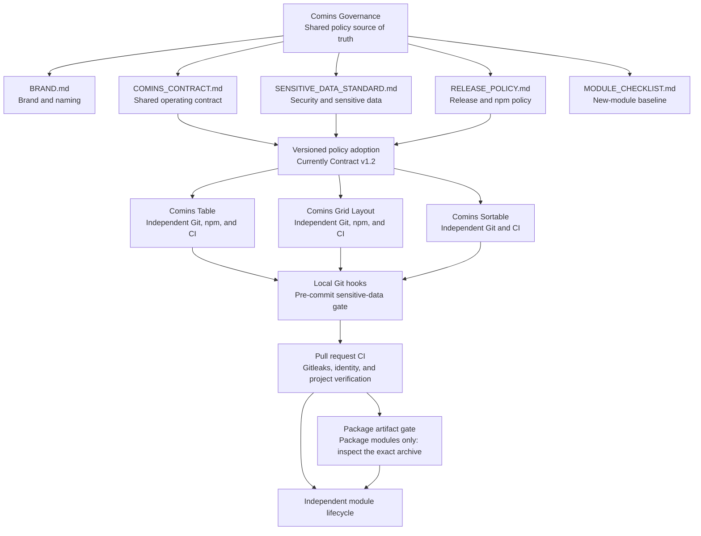

# Comins Governance

This repository is the source of truth for shared Comins brand guidance, operating contracts, and module templates.

Comins modules remain independent Git repositories and independent npm release units. This repository does not contain a runtime package, shared module source code, or a release pipeline for product packages.

## Contents

- `BRAND.md`: public product identity and naming rules.
- `COMINS_CONTRACT.md`: rules shared by every Comins module.
- `CHANGELOG.md`: shared-policy revision history.
- `MODULE_CHECKLIST.md`: readiness checklist for a new module.
- `SECURITY.md`: security reporting and response prerequisites.
- `RELEASE_POLICY.md`: package release and provenance requirements.
- `templates/module/AGENTS.md`: baseline agent guidance for a new module repository.

## Governance And Module Flow

Shared policy changes are reviewed in this repository first and then adopted by
each affected module through its own pull request. The governance repository is
not a runtime dependency and does not synchronize module source or releases.

## Operating Model

1. Make module-specific product changes in the affected module repository.
2. Make cross-module policy changes here, then update each affected module in a separate reviewed change.
3. Keep package publication, versioning, CI, and npm credentials isolated per module.
