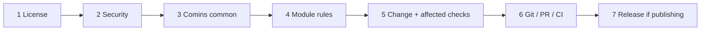

# Comins Governance

This repository owns shared Comins brand policy and the managed module guidance
template. Each Comins product remains an independent Git repository and CI
boundary. Package and release rules apply only to modules that publish a
package.

## Contents

- `BRAND.md`: product identity and naming.
- `COMINS_CONTRACT.md`: common order, scope, and approval boundaries.
- `OSS_LICENSE_POLICY.md`: third-party license review triggers.
- `SENSITIVE_DATA_STANDARD.md`: security and sensitive-data requirements.
- `RELEASE_POLICY.md`: conditional public-package release requirements.
- `MODULE_CHECKLIST.md`: new-module readiness.
- `SECURITY.md`: security reporting.
- `CHANGELOG.md`: Contract revision history.
- `templates/module/AGENTS.template.md`: managed module guidance.
- `.agents/skills/comins-reference`: module guidance adoption.
- `.agents/skills/comins-updatemd`: common-guidance audit.

## Management Order

Resolve the target independent Git root and applicable instructions first.
Contract v1.4 then fixes this common order:

1. Check license compliance.
2. Check security vulnerabilities and sensitive data.
3. Check Comins common scope, authority, and approval rules.
4. Apply the target module's own rules and commands.
5. Make the smallest change and run affected checks only.
6. Confirm Git, pull-request, and CI requirements.
7. Run release checks only for an actual publication.

```mermaid
flowchart LR
    A["1 License"] --> B["2 Security"]
    B --> C["3 Comins common"]
    C --> D["4 Module rules"]
    D --> E["5 Change + affected checks"]
    E --> F["6 Git / PR / CI"]
    F --> G["7 Release if publishing"]
```

Governance defines the order and common blocking conditions. The affected module
defines and runs the actual checker, test, browser, performance, artifact, and
consumer commands. A Governance-only change does not trigger module product
verification.

## Ownership

| Surface | Owner |
|---|---|
| Brand, common order, common policy | Governance |
| Product API, implementation, and module commands | Independent module |
| Repeated adoption or audit procedure | Governance skills |
| Current task, PR, release, and risk status | Module report or issue |

Shared behavior changes are reviewed in Governance first and adopted by each
affected module through a separate reviewed change. Governance does not
synchronize module source, tests, or releases.

## Skills

Use `$comins-reference` from an approved module root to initialize or refresh
only the managed guidance and configuration blocks. Module-owned content outside
those blocks remains unchanged.

Use `$comins-updatemd` for measured duplication, stale routing, instruction
cost, or model-guidance audits. It changes Governance only; module adoption is a
separate operation.
